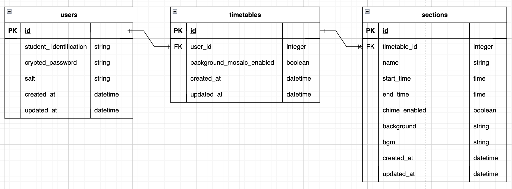

# gakkou

## サービス概要
"gakkou"は学校の空気感の再現・保存を目的としたWebアプリです。
ユーザーがいつ訪問したかにかかわらず、定刻になるとチャイムが鳴ったり放課後になったりします。

## 想定されるユーザー層
学校(日本の小中学校・高等学校)に思い入れのある人

## サービスコンセプト
大学を卒業し、学校という空間に郷愁を覚えるようになりました。
「学生生活はおしまい、もう学生になることはない」
そういう認識が寂寥を喚起するのだと思います。
べつに"学生をやり直したい"・"昔に戻りたい"わけではないので、あまりに寂しいなら、母校訪問なり図書館を利用するなりすればいいのですが、
それはなかなか手間です、普段ふとしたとき(たとえば勉強中・読書中)のノスタルジイを解消する手段としてはあまり好くありません。
そこで、「学校の空気感を再現したものがあればこの郷愁を簡単に解消できるのではないか」と思いました。
「あるいは、それがあることで、記憶の中の学校空間が普遍化される、記憶から忘失する虞も物質的に無くなる虞も気にならなくなる」
"gakkou"はそういう発想のもと開発されるアプリになります。
上記の通り、本アプリは、日本の学校(小中高)の、場所としての空気感の再現ないし保存をコンセプトとし、また、ユーザー非ユーザーを問わず、ただ存在しているだけで意味の生まれるアプリを目指しています。
そのため、主機能においては、ユーザーへの操作要求を極力排除し、一度訪問すればあとは開いているだけで基本自動で動作するような仕組みにするつもりです。
もっとも、それではすこしWebアプリとして味気なさすぎる気もするので、いわゆる実用性のある機能もあるいはおまけ程度に付け加えられたらなと思っています。

## 実装を予定している機能
### MVP
* トップページ
  * 背景の時間変化
    * ぼかし加工
  * BGMの時間変化
  * 表示(HR、授業中、休み時間、放課後、etc.)の時間変化
* 概要・使い方
* 音量調節

### その後の機能
* サインアップ
* ログイン/ログアウト
  * モーダルウィンドウによるログイン
* 時間割機能
  * 各セクション(HR、授業、休み時間、etc.)の長さの編集
  * 各セクションの表示文字列の編集
  * 各セクションのチャイムのon/off
  * 各セクションの背景の変更
  * 各セクションのBGMの変更
  * 各セクションの背景のモザイク化のon/off

## 画面遷移図
URL: https://www.figma.com/file/8A9k9dehHPyH2rW1bPY4ph/%22gakkou%22-%E7%94%BB%E9%9D%A2%E9%81%B7%E7%A7%BB%E5%9B%B3?type=design&mode=design&t=ZT1US2NemiZn9nkJ-1

## ER図

### 各テーブルとその主要カラムの役割
* usersテーブル
：ユーザーを管理する。
  * student_identificationカラム
  ：ユーザーの"学籍ID"を格納する。主キーや外部キーの名称(xx_id)と区別するためこの名称に。
* timetablesテーブル
：各ユーザーの時間割を管理する。一ユーザーにつき時間割の設定情報は一つのため、users:timetablesは1:1に。
* sectionsテーブル
：時間割の各セクション(1時間目, 休み時間, etc.)を管理する。
  * nameカラム
  ：セクション名を格納する。
  * start_timeカラム end_timeカラム
  ：それぞれセクションの開始時刻と終了時刻を格納する。
  * chime_enabledカラム
  ：そのセクションにおいてチャイムを鳴らすかどうかのフラグを格納する。
  * background_imageカラム
  ：そのセクション時に読み込む画像ファイル(背景用)のパスを格納する。
  * bgmカラム
  ：そのセクション時に読み込む音声ファイル(BGM用)のパスを格納する。
  * background_image_blur_enabledカラム
  ：背景画像にぼかしをかけるかどうかのフラグを格納する。

## 技術選定
■ 開発環境: Docker
■ サーバサイド: Ruby on Rails 7系
　　Ruby 3.2.2 Rails 7.0.8
■ フロントエンド: ?
■ CSSフレームワーク: bootstrap5系
■ インフラ:
・ Webアプリケーションサーバ: Railway
・ ファイルサーバ: ?
・ セッションサーバ: Redis（Redis by Upstash）
・ データベースサーバ: MySQL
■ その他：
・ VCS: GitHub
・ CI/CD: GitHubActions
